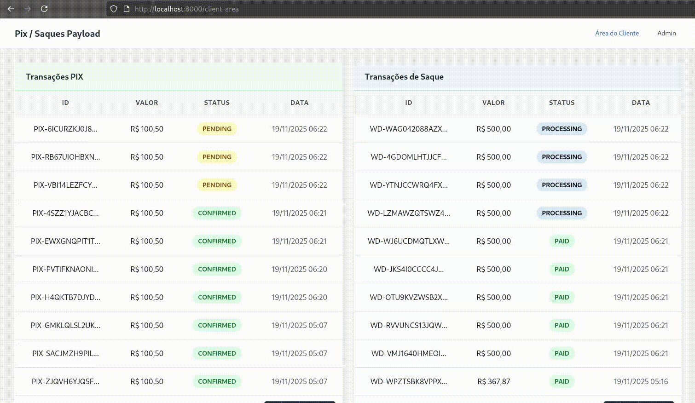

# Sistema de Integração com Subadquirentes - Laravel

Sistema de integração com subadquirentes de pagamento (gateways de PIX e saques) com arquitetura multi-tenant onde cada usuário pode usar subadquirentes diferentes.



## 📋 Requisitos Técnicos

- PHP 8.2+
- Laravel 12.38.1
- MySQL/PostgreSQL
- Composer
- Redis

## 🚀 Instalação

1. Clone o repositório, copie o arquivo de ambiente e instale as dependências PHP:
   ```bash
   git clone ...
   cd laravel-test
   cp .env.example .env
   composer install
   ```

2. Configure o arquivo `.env` com as credenciais do banco de dados e filas:
   ```env
   DB_CONNECTION=mysql
   DB_HOST=127.0.0.1
   DB_PORT=3306
   DB_DATABASE=laravel_test
   DB_USERNAME=root
   DB_PASSWORD=
   
   # Redis (recomendado para produção)
   QUEUE_CONNECTION=redis
   REDIS_HOST=127.0.0.1
   REDIS_PORT=6379
   REDIS_PASSWORD=null
   REDIS_DB=0
   APP_LOCALE=pt_BR
   APP_FALLBACK_LOCALE=pt_BR
   APP_FAKER_LOCALE=pt_BR
   APP_TIMEZONE=America/Sao_Paulo
   ```
   > O sistema já assume `America/Sao_Paulo` e `pt_BR` como padrões, garantindo horários e traduções alinhados ao contexto brasileiro.

3. Gere a chave da aplicação: `php artisan key:generate`

4. Execute as migrations: `php artisan migrate`

5. Execute os seeders básicos e, em seguida, o seeder de dados fictícios:
   ```bash
   php artisan db:seed
   php artisan db:seed --class=FakeDataSeeder  # popula transações PIX/Saque de exemplo
   ```

   Isso criará:
   - SubadqA e SubadqB (subadquirentes)
   - 3 usuários clientes (clientea@example.com, clienteb@example.com, clientec@example.com)
   - 1 usuário admin (admin@super.com / Admin@123)
   - 3 transações de cada tipo por usuário (via `FakeDataSeeder`), garantindo dados para validar a Área do Cliente

6. Instale as dependências front-end e gere os assets:
   ```bash
   npm install
   npm run build   # ou npm run dev para ambiente local
   ```

7. Inicie o Redis (necessário antes do Horizon). Caso não tenha o serviço instalado localmente, use o container incluso:
   ```bash
   docker compose up -d redis
   ```
   > Sem o Redis rodando, o Horizon não consumirá as filas e os status permanecerão em `PENDING`.

8. **Inicie o Laravel Horizon** (gerenciador de filas com auto-scaling). Sem o Horizon/queue worker ativo as transações permanecerão em `PENDING`, pois todo o fluxo com subadquirentes e webhooks é assíncrono:
   ```bash
   php artisan horizon
   ```
   
   **Nota:** O Horizon gerencia automaticamente os workers. Acesse o dashboard em `http://localhost:8000/horizon`

9. Inicie o servidor: `php artisan serve`

10. (Opcional) Rode a suíte de testes de carga básica (requer k6):
    ```bash
    # Terminal separado do Horizon/Redis
    export API_TOKEN="1|sua-token-gerada-no-/api/login"
    export BASE_URL="http://127.0.0.1:8000"   # ajuste se preciso
    k6 run tests/loadtest.js
    ```
    > O cenário padrão dispara ~6 requisições/segundo em `/api/pix`, garantindo que o pipeline (jobs + webhooks) seja exercitado acima do requisito mínimo de 3 req/s.

## 🖥️ Servidor HTTP + Assets em paralelo

A aplicação front usa Vite/Tailwind. Execute **dois processos** paralelos em terminais separados:

```bash
# Terminal 1
php artisan serve

# Terminal 2
npm run dev   # mantém Vite observando alterações; use npm run build para produção
```

Caso prefira um único terminal, você pode usar um gerenciador como `npm-run-all` ou `foreman`, mas manter dois processos separados facilita depuração.

## 🔐 Autenticação

O sistema usa Laravel Sanctum para autenticação via API. 

**Endpoint:** `POST /api/login`

**Usuários de teste:**
- `clientea@example.com` / `password` (SubadqA)
- `clienteb@example.com` / `password` (SubadqB)
- `clientec@example.com` / `password` (SubadqA)
- `admin@super.com` / `Admin@123` (Admin)

### Como usar o token:

1. **Via Swagger UI:**
   - Acesse `http://localhost:8000/api/documentation`
   - Execute o endpoint `/api/login` com suas credenciais
   - Copie o token retornado no campo `data.token`
   - Clique no botão **"Authorize"** no topo da página
   - Cole o token no campo (sem o prefixo "Bearer")
   - Agora você pode testar os endpoints protegidos

2. **Via cURL/Postman:**
   - Execute `POST /api/login` e copie o token da resposta
   - Use no header: `Authorization: Bearer {token}`

**Importante:** O token é dinâmico e deve ser obtido através do endpoint `/api/login`. 

## 📡 API Endpoints

**Base URL:** `http://localhost:8000/api`

### Documentação Swagger/OpenAPI

Acesse a documentação interativa em: `http://localhost:8000/api/documentation`

A documentação inclui todos os endpoints, exemplos de requisições/respostas, validações e permite testar diretamente no navegador.

**Como usar:**
1. Primeiro, execute o endpoint `/api/login` para obter um token
2. Clique no botão **"Authorize"** no topo da página Swagger
3. Cole o token obtido do login (sem o prefixo "Bearer")
4. Agora você pode testar os endpoints protegidos (`/api/pix`, `/api/withdraw`)

Para regenerar após alterações: `php artisan l5-swagger:generate`

### Endpoints Disponíveis

- **POST** `/api/login` - Autenticação e obtenção de token
- **POST** `/api/logout` - Revogar token atual
- **POST** `/api/pix` - Criar transação PIX
- **POST** `/api/withdraw` - Criar transação de saque

Todos os endpoints (exceto login) requerem autenticação via Bearer Token.

## 🔄 Fluxo de Transação

1. Usuário solicita PIX/Saque via API
2. Sistema identifica o subadquirente do usuário
3. Envia requisição para API mock do subadquirente
4. Registra transação com status `PENDING`
5. Dispara Job para simular webhook após 5-10 segundos
6. Webhook atualiza status para `CONFIRMED`/`PAID`

## 🏗️ Arquitetura

### Estrutura Principal

- **Contracts/SubacquirerInterface.php** - Interface para subadquirentes
- **Services/SubacquirerService.php** - Serviço principal de gerenciamento
- **Services/Subacquirers/GenericSubacquirer.php** - Implementação genérica para todos os subadquirentes
- **Jobs/** - Processamento assíncrono de webhooks
- **Models/** - Models de transações, usuários e subadquirentes

### Extensibilidade

O sistema usa uma implementação genérica (`GenericSubacquirer`) que funciona para todos os subadquirentes. SubadqA e SubadqB são apenas registros na tabela `subacquirers` com diferentes URLs de API.

Para adicionar um novo subadquirente, basta adicionar um registro na tabela `subacquirers`. Se precisar de comportamento específico, crie uma classe customizada implementando `SubacquirerInterface` e registre no `SubacquirerService`.

## 📊 Banco de Dados

### Tabelas Principais

- `users` - Usuários do sistema
- `subacquirers` - Subadquirentes disponíveis
- `pix_transactions` - Transações PIX
- `withdraw_transactions` - Transações de saque
- `jobs` - Fila de jobs (para webhooks)

### Status de Transações

**PIX:** `PENDING`, `CONFIRMED`, `FAILED`, `CANCELLED`

**Saque:** `PENDING`, `PAID`, `FAILED`, `CANCELLED`

## 🔧 Configuração

### Filas e Redis

O sistema utiliza **Laravel Horizon** para gerenciamento dinâmico de workers com auto-scaling.

**Configuração do Redis:**

O sistema usa **Predis** (biblioteca PHP pura) por padrão, não requer extensão PHP Redis.

**1. Instale o servidor Redis:**

**Ubuntu/Debian:**
```bash
sudo apt-get update
sudo apt-get install redis-server
sudo systemctl start redis-server
sudo systemctl enable redis-server
```

**macOS (via Homebrew):**
```bash
brew install redis
brew services start redis
```

**2. Configure no `.env`:**
```env
QUEUE_CONNECTION=redis
REDIS_CLIENT=predis
REDIS_HOST=127.0.0.1
REDIS_PORT=6379
REDIS_PASSWORD=null
REDIS_DB=0
```

**3. Verifique se o Redis está rodando:**
```bash
redis-cli ping
# Deve retornar: PONG
```

**Nota:** Se preferir usar a extensão `phpredis` (mais rápida), instale a extensão PHP e configure `REDIS_CLIENT=phpredis`.

### ✅ Rodar Redis via Docker

Se não quiser instalar o Redis localmente:

```bash
docker compose up -d redis
```

O serviço expõe a porta `6379` (mapeada para `localhost`), então nenhuma alteração adicional no `.env` é necessária. Para parar:

```bash
docker compose down
```

#### Automatizando Redis + Horizon

Para não esquecer de subir as filas, você pode rodar em um único terminal:

```bash
docker compose up -d redis && php artisan horizon
```

Isso garante que o Redis esteja ativo antes de o Horizon iniciar. Em produção, configure um serviço (Supervisor/systemd) que execute essa sequência automaticamente para manter os workers vivos após reboot.

**Configuração do Horizon:**

O Horizon está configurado para:
- **Filas processadas:** `transactions` (prioridade) e `webhooks`
- **Auto-scaling:** 3-10 workers em produção, 2-5 em desenvolvimento
- **Balanceamento:** Automático baseado em tempo de espera
- **Retry:** 3 tentativas com backoff exponencial (5s, 10s, 30s)

**Iniciar o Horizon:**

```bash
php artisan horizon
```

**Acessar o Dashboard:**

Após iniciar o Horizon, acesse: `http://localhost:8000/horizon`

**Nota:** Para produção, configure o Horizon como serviço usando Supervisor ou systemd para garantir que ele sempre esteja rodando.

### Logging

Todos os eventos importantes são registrados em `storage/logs/laravel.log`:
- Requisições aos subadquirentes
- Respostas dos subadquirentes
- Processamento de webhooks
- Erros e exceções

## 🚨 Tratamento de Erros

- Validação de dados de entrada
- Tratamento de erros de API dos subadquirentes
- Retry automático (3 tentativas com backoff exponencial: 5s, 10s, 30s)
- Locks para evitar processamento duplicado de webhooks
- Logging detalhado

### Workaround para Postman Mock

O sistema implementa um fallback para problemas conhecidos do Postman Mock (`invalid_amount` e `mockRequestNotFoundError`). Quando esses erros ocorrem, o sistema simula uma resposta de sucesso e registra um warning no log, permitindo que a aplicação continue funcionando.

## 📈 Performance

- Suporta 3+ requisições/segundo
- **Laravel Horizon** com auto-scaling dinâmico de workers (3-10 workers)
- **Processamento assíncrono** de transações (PIX e Withdraw processados em background)
- Processamento assíncrono de webhooks com delay configurável (5-10 segundos)
- Jobs executados em filas dedicadas (`transactions` e `webhooks`) via Redis
- **Rate limiting** configurado (200 requisições/minuto por usuário autenticado)
- Locks distribuídos para evitar processamento duplicado
- Retry exponencial para falhas temporárias (3 tentativas: 5s, 10s, 30s)
- Índices otimizados no banco de dados
- Dashboard Horizon para monitoramento em tempo real

## 🧪 Teste de carga com k6

O arquivo `tests/loadtest.js` simula requisições PIX em alta taxa para validar a robustez do fluxo assíncrono (incluindo webhooks).

1. **Pré-requisitos**
   - Redis e Horizon ativos (`docker compose up -d redis && php artisan horizon`)
   - Banco populado (`php artisan migrate --seed && php artisan db:seed --class=FakeDataSeeder`)
   - Credenciais de um usuário de teste (por padrão, `clientea@example.com` / `password`; personalizável via `K6_EMAIL` e `K6_PASSWORD`)
   - [k6 instalado](https://k6.io/docs/getting-started/installation/)

2. **Executando o teste**

   **Local (k6 instalado na máquina):**
   ```bash
   docker compose run --rm \
     -e BASE_URL="http://host.docker.internal:8000" \
     # opcional: sobrescreva o usuário/senha de teste
     -e K6_EMAIL="clientea@example.com" \
     -e K6_PASSWORD="password" \
     k6 run tests/loadtest.js
   ```

   > O script executa o `POST /api/login` automaticamente no `setup`, então não é preciso copiar token manualmente. Em Linux, `host.docker.internal` é criado automaticamente via `extra_hosts`; ajuste o host se o servidor Laravel estiver em outro endereço.

3. **O que o teste faz**
   - Usa um cenário `constant-arrival-rate` enviando 6 req/s para `/api/pix`
   - Cada chamado gera um PIX que dispara `ProcessPixTransaction` + `SimulatePixWebhook`, validando também o fluxo de webhooks
   - Define limiares (`http_req_failed < 5%`, `p95 < 2s`). Ajuste os valores conforme necessidade

4. **Personalizações**
   - Modifique `options.rate` para aumentar/diminuir o throughput
   - Use `BASE_URL` para apontar para ambientes diferentes (ex.: staging)
   - Adapte o payload no script caso precise testar outros subadquirentes ou cenários de erro
   - Em ambientes `local`/`testing` o rate limit autenticado é elevado automaticamente (`throttle:2000,1`) para permitir os testes de carga; em produção permanece `throttle:200,1`

5. **Resultados do teste**
   - 721 requisições concluídas em 2 minutos (≈6 req/s sustentadas)
   - 0 falhas (`http_req_failed = 0%`)
   - `http_req_duration p95 ≈ 35 ms`
   - Comprovado que o fluxo aguenta ≥ 3 requisições/segundo (PIX + webhooks)

## 🔒 Segurança

- Autenticação via Laravel Sanctum
- Validação de dados de entrada
- Proteção contra SQL Injection (Eloquent ORM)
- Logs de auditoria

## 📚 Recursos Adicionais

- [Documentação Laravel](https://laravel.com/docs)
- [Laravel Sanctum](https://laravel.com/docs/sanctum)
- [Laravel Queues](https://laravel.com/docs/queues)

---
